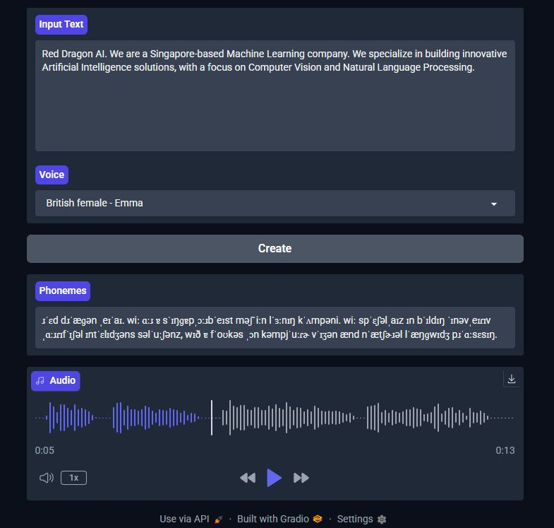

# Kokoro TTS served using Grindo, containerised in Docker
This repo is submitted as fulfillment of the Red DragonAI - AI in Production course project (run: Feb 2025).<br />

<p align="center">
  
</p>

## Overview

- **Kokoro TTS** was chosen as the model. The `model_q8f16.onnx` was selected for its small model size and high speed during inference. The ONNX model ensures a framework-agnostic inference.
- **Grindo** was selected as the frontend to provide users with an interactive interface to engage with the model, and to easily enable concurrency of service (set to concurrency_limit=3 in this case).
- **Docker** was chosen as the container solution to ensure an environment-agnostic deployment.

## Setup Instructions

To start the app, follow these steps:

1. **Build the Docker image:**

   ```bash
   docker build -t kokoro-gradio-app:v1 .
2. **Run the container:**
    ```bash
    docker run -it -p 7860:7860 kokoro-gradio-app:v1
3. **Below is shown after successfully running the container:**
   ```
   * Running on local URL:  http://0.0.0.0:7860
  2025-02-24 10:48:20 - INFO - HTTP Request: GET http://localhost:7860/gradio_api/startup-events "HTTP/1.1 200 OK"
  2025-02-24 10:48:20 - INFO - HTTP Request: HEAD http://localhost:7860/ "HTTP/1.1 200 OK"
  
  To create a public link, set `share=True` in `launch()`.
  2025-02-24 10:48:21 - INFO - HTTP Request: GET https://api.gradio.app/pkg-version "HTTP/1.1 200 OK"
  ```
After running the container, the app can be accessed at http://localhost:7860.
